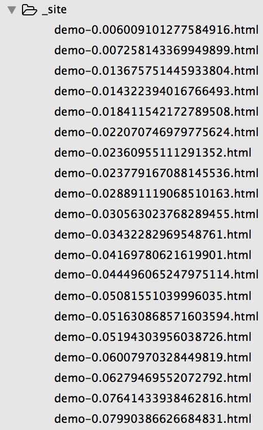
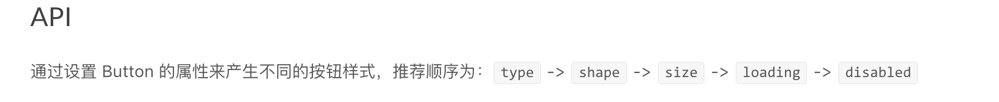

## 1.jsonML格式
如下是html内容：
```html
<ul>
    <li style="color:red">First Item</li>
    <li title="Some hover text." style="color:green">
    Second Item
    </li>
    <li><span class="code-example-third">Third</span>
    Item</li>
</ul>
```

下面是解析出来的jsonML内容：
```json
["ul",
//每一个标签都是一个数组，数组中第一个元素是标签名，第二个元素是属性名，第三个是子元素
    ["li",
        { "style" : "color:red" },
        "First Item"
    ],
    //第一个元素也是一个数组
    ["li",
        {
        "title" : "Some hover text.",
        "style" : "color:green"
        },
        "Second Item"
    ],
    //第二个元素也是一个数组
    ["li",
        ["span",
        { "class" : "code-example-third" },
        "Third"
        ],
        " Item"
    ]
    //第三个元素也是一个数组
]
```

## 2.bisheng-plugin-antd中对于markdown部分的语法要求
 
 注意：这里所说的语法要求，其实就是按照一定的规则来解析出我们需要的node阶段~

### 2.1 中文介绍`节点node`

```js
  function getChineseIntroStart(contentChildren) {
  return contentChildren.findIndex(node =>
     JsonML.getTagName(node) === 'h2' &&
      JsonML.getChildren(node)[0] === 'zh-CN'
  );
}
```

注意：中文部分的`node`内容要满足以下的条件：

  首先：content内容部分

  然后：该node的tagName为'h2'

  最后：该node的第一个元素为'zh-CN'

### 2.2 英文介绍`节点node`

```js
function getEnglishIntroStart(contentChildren) {
  return contentChildren.findIndex(node =>
     JsonML.getTagName(node) === 'h2' &&
      JsonML.getChildren(node)[0] === 'en-US'
  );
}
```

英文部分的内容要满足以下的条件：

  首先：content内容部分

  然后：该node的tagName为'h2'

  最后：该node的第一个元素为'en-US'

### 2.3 代码部分`节点node`

```js
function getCodeIndex(contentChildren) {
  return contentChildren.findIndex(node =>
     JsonML.getTagName(node) === 'pre' &&
      JsonML.getAttributes(node).lang === 'jsx'
  );
}
```

code部分满足一下条件:

  首先：content内容部分

  然后：该node的tagName为'pre'

  最后：该node的attribute中的lang为'jsx'

  `注意：在这个plugin中，我们的中文部分结束在最前面，英文部分次之，我们的代码部分是最后的~`

### 2.4 该plugin对于markdownData内容的修改

他会为我们的markdownData对象添加`content,highlightedCode（来自于bisheng-plugin-highlighted）,preview,hightlightedStyle（来自于bisheng-plugin-highlighted）,style，src(如果meta配置了iframe那么要在cwd/_site下写入demo页面)`等属性。同时默认还要meta,toc等属性。其中带有前缀的属性比如hightlightedStyle和highlightedCode都是通过bisheng-plugin-highlighted进行处理后得到的。

添加markdownData.content部分：

```js
  const codeIndex = getCodeIndex(contentChildren);
  //得到code标签下标
  const introEnd = codeIndex === -1 ? contentChildren.length : codeIndex;
  //如果有代码部分，那么结束就是代码部分index，否则就是content部分的子元素的长度
  if (chineseIntroStart > -1 ) {
    markdownData.content = {
      'zh-CN': contentChildren.slice(chineseIntroStart + 1, englishIntroStart),
      'en-US': contentChildren.slice(englishIntroStart + 1, introEnd),
    };
  } else {
    markdownData.content = contentChildren.slice(0, introEnd);
  }
```

如果有中文介绍，那么英文介绍以前都是`zh-CN`部分，这部分对于ant design页面的页头部分，因此没有code代码，而剩下的部分都是英文介绍（`因为中英文的介绍code部分都是公用的`）。

获取code部分的内容：

```js
 const codeIndex = getCodeIndex(contentChildren);
 //得到子元素pre标签的下标
 const sourceCodeObject = getSourceCodeObject(contentChildren, codeIndex);
 function getCode(node) {
  return JsonML.getChildren(
    JsonML.getChildren(node)[0]//code标签
  )[0];
}
//得到code标签中的内容
function getSourceCodeObject(contentChildren, codeIndex) {
  if (codeIndex > -1) {
    return {
      isES6: true,
      code: getCode(contentChildren[codeIndex]),
    };
  }
  return {
    isTS: true,
    //TypeScript,因为我们的codeIndex是通过获取属性为jsx的pre标签得到的
  };
}
```

所以，到这里我们就获取到的code标签其中的内容了

为我们的markdown这个文件树jsonML添加`markdownData.highlightedCode`,`markdownData.preview`属性：

```js
  if (sourceCodeObject.isES6) {
    //表示有我们的pre标签包裹的代码
    markdownData.highlightedCode = contentChildren[codeIndex].slice(0, 2);
    //contentChildren[codeIndex]内容见output/index.js,通过bisheng-plugin-hightlighted处理后我们的pre标签的属性中已经含有了pre标签的code内容经过高亮处理后的代码了，把它作为 markdownData.highlightedCode属性
    markdownData.preview = utils.getPreview(sourceCodeObject.code);
    //这是获取到真实内容，没有高亮显示过！
  } else {
    const requireString = `require('!!babel!${watchLoader}!${getCorrespondingTSX(meta.filename)}')`;
    markdownData.highlightedCode = {
      __BISHENG_EMBEDED_CODE: true,
      code: `${requireString}.highlightedCode`,
    };
    markdownData.preview = {
      __BISHENG_EMBEDED_CODE: true,
      code: `${requireString}.preview`,
    };
  }
```

其中highlightedCode在Demo这个组件中是如下展示：

```html
 <div className="highlight">
   {props.utils.toReactComponent(highlightedCode)}
   //所以hightedCode表示的是收缩展开的代码内容,我们上面已经封装到了markdownData中了，其内容就是pre标签中code标签内容经过高亮处理后的结果(但是包括语言和属性)
</div>
```

我们看看markdownData.preview的内容：

```jsx
'use strict';
const path = require('path');
const pkgPath = path.join(process.cwd(), 'package.json');
const pkgName = require(pkgPath).name;
//项目名称
const componentsPath = path.join(process.cwd(), 'components');
//sourceCode就是原生的pre标签下的code标签的内容
exports.getPreview = function getPreview(sourceCode) {
 //传入的是pre标签下的code
  const preview = [
    'pre', { lang: '__react' },
  ];
  preview.push([
    'code',
    sourceCode.replace(`${pkgName}/lib`, componentsPath),
    //把code标签内部的`${pkgName}/lib`修改为'cwd/components'
  ]);
  return preview;
};
```

所以，*这里我们的preview其实就是添加了我们的pre标签和code标签，其中code标签的内容是没有highlighted的内容(从原始markdownData获取)，code标签内的文件路径被修改了。所有preview本身也是一个对象。而且必须要注意，这里的lang都转化为了__react,这会在我们的bisheng-plugin-react中的jsonml-react-loader中进一步处理，变成可以实际展示的组件*。

我们看看在Demo组件中是如何对我们的preview进行处理的：

```jsx
 if(!this.liveDemo){
    this.liveDemo=meta.iframe ? <iframe src={src}\/> : preview(React, ReactDOM);
 }
```

但是上面的markdown.preview是一个对象，怎么会可以直接调用了，那么我给你看看上面的jsonml-react-loader中的代码：

```js
module.exports = function transformer(content, lang) {
  let imports = [];
  const inputAst = parser(content);
  traverse(inputAst, {
    ArrayExpression: function(path) {
      const node = path.node;
      const firstItem = node.elements[0];
      const secondItem = node.elements[1];
      let renderReturn;
      if (firstItem &&
        firstItem.type === 'StringLiteral' &&
        firstItem.value === 'pre' &&
        secondItem.properties[0].value.value === lang) {
        let codeNode = node.elements[2].elements[1];
        let code = codeNode.value;
        const codeAst = parser(code);
        traverse(codeAst, {
          ImportDeclaration: function(importPath) {
            imports.push(importPath.node);
            importPath.remove();
          },
          CallExpression: function(CallPath) {
            const CallPathNode = CallPath.node;
            if (CallPathNode.callee &&
              CallPathNode.callee.object &&
              CallPathNode.callee.object.name === 'ReactDOM' &&
              CallPathNode.callee.property &&
              CallPathNode.callee.property.name === 'render') {
              renderReturn = types.returnStatement(
                CallPathNode.arguments[0]
              );
              CallPath.remove();
            }
          },
        });
        const astProgramBody = codeAst.program.body;
        const codeBlock = types.BlockStatement(astProgramBody);
        // ReactDOM.render always at the last of preview method
        if (renderReturn) {
          astProgramBody.push(renderReturn);
        }
        const coceFunction = types.functionExpression(
          types.Identifier('jsonmlReactLoader'),
          [],
          codeBlock
        );
        path.replaceWith(coceFunction);
      }
    },
  });
  return {
    imports: imports,
    inputAst: inputAst,
  };
};
```

*也就是说，这个loader就是专门处理上面markdown.preview这种lang为__react的内容，同时把preivew转化为一个函数调用*！所以我们的preview会转化为如下的结构:

```js
preview:jsonmlReactLoader(){}
```

具体转化成为的代码可以参考'./output/preview.js'

如果不是ES6的code，那么我们会如下处理：
```js
    const watchLoader = path.join(__dirname, './loader/watch');
    //添加一个loader
    function getCorrespondingTSX(filename) {
      return path.join(process.cwd(), filename.replace(/\.md$/i, '.tsx'));
    }
   //把.md的文件后缀修改为'.tsx',也就是typeScript代码
   {
    const requireString = `require('!!babel!${watchLoader}!${getCorrespondingTSX(meta.filename)}')`;
    markdownData.highlightedCode = {
      __BISHENG_EMBEDED_CODE: true,
      code: `${requireString}.highlightedCode`,//code是经过loader处理过的
    };
    markdownData.preview = {
      __BISHENG_EMBEDED_CODE: true,
      code: `${requireString}.preview`,
    };
  }
```

我们再来看看watchLoader代码：
```js
'use strict';
const ts = require('typescript');
const generator = require('babel-generator').default;
const transformer = require('bisheng-plugin-react/lib/transformer');
const utils = require('../utils');
//处理typeScript
module.exports = function watch(tsCode) {
  if (this.cacheable) {
    this.cacheable();
  }
  const es6Code = ts.transpileModule(tsCode, {
    //tsCode是一个文件路径
    compilerOptions: {
      jsx: 'preserve',
      target: 'es6'
    },
  }).outputText;
  //获取TypeScript编译后的代码
  const highlightedCode = {
    es6: Prism.highlight(es6Code, Prism.languages.jsx),
    ts: Prism.highlight(tsCode, Prism.languages.typescript),
  };
  const preprocessedCode = JSON.stringify(utils.getPreview(es6Code));
  const res = transformer(preprocessedCode, '__react');
  //手动让transformer处理转化为函数，那么typescrpt也可以调用
  const preview = generator(res.inputAst, null, preprocessedCode).code;
  res.inputAst.program.body = res.imports;
  const imports = generator(res.inputAst, null, preprocessedCode).code;
  return `${imports}\n` +
    'module.exports = {\n' +
    `  highlightedCode: ${JSON.stringify(highlightedCode)},\n` +
    `  preview: ${preview.replace(/;$/, '')}` +
    '\n}';
}
```

如果是TypeScript也会处理成含有higlightedCode和preview属性的对象。[Prism文档](https://github.com/benjycui/node-prismjs)

接下来就是获取markdownData.style和hightlightedStyle表示内联的css样式：
```jsx
    function isStyleTag(node) {
      return node && JsonML.getTagName(node) === 'style';
    }
    //标签名为style或者pre标签上的lang为css的Node，但是我们都是只会获取到第一个元素内容
    function getStyleNode(contentChildren) {
      return contentChildren.filter(node =>
         isStyleTag(node) ||
          (JsonML.getTagName(node) === 'pre' && JsonML.getAttributes(node).lang === 'css')
      )[0];
    }
  // Add style node to markdown data.
  const styleNode = getStyleNode(contentChildren);
  if (isStyleTag(styleNode)) {
    //如果标签本身是style标签那么我们封装到markdownData.style上
    markdownData.style = JsonML.getChildren(styleNode)[0];
  } else if (styleNode) {
    //如果标签本身不是style标签
    const styleTag = contentChildren.filter(isStyleTag)[0];
    //那么我们获取content中第一个style标签
    markdownData.style = getCode(styleNode) + (styleTag ? JsonML.getChildren(styleTag)[0] : '');
    markdownData.highlightedStyle = JsonML.getAttributes(styleNode).highlighted;
    //highlightedStyle就是为了原样显示的部分，所以是通过JsonML处理过的，而style是直接插入的
  }
```

如果我们的第一个css样式(包括pre的lang为css,或者style标签)标签本身就是`style`标签，那么我们的markdownData中的style中封装的仅仅是style标签的内容，没有其他的属性

```jsx
<style>
[id^=components-button-demo-] .ant-btn {
  margin-right: 8px;
  margin-bottom: 12px;
}
[id^=components-button-demo-] .ant-btn-group \> .ant-btn {
  margin-right: 0;
}
<\/style>
```

*如果第一个控制样式的不是style标签而是pre，那么style属性就会包括pre标签的内容和第一个style标签的内容(如果有);而highlightedStyle只会包含pre标签的内容，因为他是通过bisheng-plugin-highlighted进行对pre标签的处理的*。但是我们只会关注第一个pre标签和style标签(具体还没有想明白)

```jsx
      {
            highlightedStyle ?
              <div key="style" className="highlight">
                <pre>
                  <code className="css" dangerouslySetInnerHTML={{ __html: highlightedStyle }} />
                </pre>
              </div> :
              null
          }
```

这里的highlightedStyle是原样显示的css内容,而markdownData.style是直接作为style的内容插入的，是为了控制页面的真实显示样式的：

```jsx
     <section className="code-box-demo">
          {this.liveDemo}
          {
            style ?
              <style dangerouslySetInnerHTML={{ __html: style }} /> :
              null
          }
    <\/section>
```

我们继续往下分析：
```jsx
const babelrc = {
  presets: ['es2015', 'react'].map(m =>
     require.resolve(`babel-preset-${m}`)
  ),
};
const tmpl = fs.readFileSync(path.join(__dirname, 'template.html')).toString();
  if (meta.iframe) {
    const html = nunjucks.renderString(tmpl, {
      id: meta.id,
      //meta.id = meta.filename.replace(/\.md$/, '').replace(/\//g, '-');这个id作为页面中这个div的id的值
      style: markdownData.style,
      //style标签的内容，或者<pre class="css"/>的内容加上第一个style标签的内容。用于页面样式控制的css
      script: babel.transform(getCode(markdownData.preview), babelrc).code,
      //获取preview中的code内容,其中code代码是没有经过hightlighted高亮处理的代码，并经过babel处理并作为内联的script插入
    });
    const fileName = `demo-${Math.random()}.html`;
    fs.writeFile(path.join(process.cwd(), '_site', fileName), html);
    //在_site目录下写一个文件名随机的preview页面html
    markdownData.src = path.join('/', fileName);
    //同时添加src
  }
```

获取`node_modules/bisheng-plugin-antd`这个插件的template.html文件,如果meta中配置了iframe，那么我们要进行特殊的处理。*我们首先在cwd下的_site目录下写一个html文件，同时在markdownData的src属性中保存这个src目录，这个文件就是预览页面*。html模板内容如下：
```html
<!DOCTYPE html>
<html>
  <head>
    <title>Demo</title>
    <link rel="stylesheet" href="../index.css" />
    <link rel="stylesheet" href="../index-1.css" />
    <link rel="stylesheet" href="../index-2.css" />
    <style>
      html, body {
        height: 100%;
        margin: 0;
        background: none;
      }
      {{ style }}
    </style>
  </head>
  <body>
    <div id="{{ id }}" class="code-box-demo"></div>
    <script>
      function require(module) {
        if (module === 'react-router') {
          return window.ReactRouter;
        }
        return window.parent[module];
      }
      var mountNode = document.getElementById('{{ id }}');
      //被插入的节点
    </script>
    <script src="https://unpkg.com/react/dist/react.js"></script>
    <script src="https://unpkg.com/react-dom/dist/react-dom.js"></script>
    <script src="https://unpkg.com/react-router/umd/ReactRouter.js"></script>
    <script>
      {{ script }}
    </script>
  </body>
</html>
```

总之，`该插件就是为我们的markdownData添加highlightedCode,content,preview,style,highlightedStyle，src等属性，都是通过文件树的jsonML解析得到的`。其中内联的script得到的内容是如下的样式:

```js
  'use strict';
var _reactRouter = require('react-router');
var _antd = require('antd');
var Apps = function Apps() {
  return React.createElement(
    'ul',
    { className: 'app-list' },
    React.createElement(
      'li',
      null,
      React.createElement(
        _reactRouter.Link,
        { to: '/apps/1' },
        'Application1'
      ),
      '\uFF1A',
      React.createElement(
        _reactRouter.Link,
        { to: '/apps/1/detail' },
        'Detail'
      )
    ),
    React.createElement(
      'li',
      null,
      React.createElement(
        _reactRouter.Link,
        { to: '/apps/2' },
        'Application2'
      ),
      '\uFF1A',
      React.createElement(
        _reactRouter.Link,
        { to: '/apps/2/detail' },
        'Detail'
      )
    )
  );
};

var Home = function Home(_ref) {
  var routes = _ref.routes,
      params = _ref.params,
      children = _ref.children;
  return React.createElement(
    'div',
    null,
    React.createElement(
      'div',
      { className: 'demo-nav' },
      React.createElement(
        _reactRouter.Link,
        { to: '/' },
        'Home'
      ),
      React.createElement(
        _reactRouter.Link,
        { to: '/apps' },
        'Application List'
      )
    ),
    children || 'Home Page',
    React.createElement(_antd.Alert, { style: { margin: '16px 0' }, message: 'Click the navigation above to switch:' }),
    React.createElement(_antd.Breadcrumb, { routes: routes, params: params })
  );
};
ReactDOM.render(React.createElement(
  _reactRouter.Router,
  { history: _reactRouter.hashHistory },
  React.createElement(
    _reactRouter.Route,
    { name: 'home', breadcrumbName: 'Home', path: '/', component: Home },
    React.createElement(
      _reactRouter.Route,
      { name: 'apps', breadcrumbName: 'Application List', path: 'apps', component: Apps },
      React.createElement(
        _reactRouter.Route,
        { name: 'app', breadcrumbName: 'Application:id', path: ':id' },
        React.createElement(_reactRouter.Route, { name: 'detail', breadcrumbName: 'Detail', path: 'detail' })
      )
    )
  )
), mountNode);
```

所以说我们最后会在项目的_site目录下生产很多的demo页面并使用iframe来显示：


### 1.5 我们demo页面中的js是如何进行编译好的

#### 1.5.1 处理页面中的demo内容(对应于显示组件中的ComponentDoc组件，其会实例化Demo组件)

首先我们要知道bisheng-plugin-antd是最后一个配置在bisheng.config.js文件中的plugin

```js
plugins: [
    'bisheng-plugin-description',//抽取markdown文件的中间的description部分
    'bisheng-plugin-toc?maxDepth=2&keepElem',//产生一个目录
    'bisheng-plugin-react?lang=__react',//将markdown书写的jsx转换成为React.createElement从而能够真正在页面中显示出来
    'bisheng-pugin-antd',//为markdownData添加属性，生成demo页面
  ]
```

要知道如何生成demo页面我们还是要仔细分析下下面的代码:

```js
 if (meta.iframe) {
    const html = nunjucks.renderString(tmpl, {
      id: meta.id,
      style: markdownData.style,
      script: babel.transform(getCode(markdownData.preview), babelrc).code,
    });
    const fileName = `demo-${Math.random()}.html`;
    fs.writeFile(path.join(process.cwd(), '_site', fileName), html);
    markdownData.src = path.join('/', fileName);
  }
```

我们再给出一个传入到babel.transform中的`getCode(markdownData.preview)`值:

```jsx
import { Router, Route, Link, hashHistory } from 'react-router';
import { Breadcrumb, Alert } from 'antd';
const Apps = () => (
  <ul className="app-list">
    <li>
      <Link to="/apps/1">Application1</Link>：<Link to="/apps/1/detail">Detail</Link>
    </li>
    <li>
      <Link to="/apps/2">Application2</Link>：<Link to="/apps/2/detail">Detail</Link>
    </li>
  </ul>
);
const Home = ({ routes, params, children }) => (
  <div>
    <div className="demo-nav">
      <Link to="/">Home</Link>
      <Link to="/apps">Application List</Link>
    </div>
    {children || 'Home Page'}
    <Alert style={{ margin: '16px 0' }} message="Click the navigation above to switch:" />
    <Breadcrumb routes={routes} params={params} />
  </div>
);
ReactDOM.render(
  <Router history={hashHistory}>
    <Route name="home" breadcrumbName="Home" path="/" component={Home}>
      <Route name="apps" breadcrumbName="Application List" path="apps" component={Apps}>
        <Route name="app" breadcrumbName="Application:id" path=":id">
          <Route name="detail" breadcrumbName="Detail" path="detail" />
        </Route>
      </Route>
    </Route>
  </Router>
, mountNode);
```

这时候你肯定很疑惑，为什么这时候我们传入的是jsx，而不是上面的jsonML?其实上面我已经提到过了，我们的preview方法在jsonml-react-loader中转化成了一个函数了(`我们bisheng-plugin-antd的node代码的执行是在jsonml-react-loader之前的，因为markdown-loader就是为了处理md文件的，其会解析所有的plugin下的node.js并执行，所以传递到我们的jsonml-react-loader的时候已经是jsonml文件了`)。此处我再给出一次代码：

```js
'use strict';
const loaderUtils = require('loader-utils');
const generator = require('babel-generator').default;
const transformer = require('./transformer');
module.exports = function jsonmlReactLoader(content) {
  if (this.cacheable) {
    this.cacheable();
  }
  const query = loaderUtils.parseQuery(this.query);
  const lang = query.lang || 'react-example';
  const res = transformer(content, lang);
  const inputAst = res.inputAst;
  const imports = res.imports;
  for (let k = 0; k < imports.length; k++) {
    inputAst.program.body.unshift(imports[k]);
  }
  const code = generator(inputAst, null, content).code;
  const noreact = query.noreact;
  if (noreact) {
    return code;
  }
 var returnVal='import React from \'react\';\n' +
    'import ReactDOM from \'react-dom\';\n' +
    code;
  return returnVal;
};
```

transformer如下:

```jsx
'use strict';
const babylon = require('babylon');
const types = require('babel-types');
const traverse = require('babel-traverse').default;
function parser(content) {
  return babylon.parse(content, {
    sourceType: 'module',
    plugins: [
      'jsx',
      'flow',
      'asyncFunctions',
      'classConstructorCall',
      'doExpressions',
      'trailingFunctionCommas',
      'objectRestSpread',
      'decorators',
      'classProperties',
      'exportExtensions',
      'exponentiationOperator',
      'asyncGenerators',
      'functionBind',
      'functionSent',
    ],
  });
}
module.exports = function transformer(content, lang) {
  let imports = [];
  const inputAst = parser(content);
  traverse(inputAst, {
    ArrayExpression: function(path) {
      const node = path.node;
      const firstItem = node.elements[0];
      const secondItem = node.elements[1];
      let renderReturn;
      if (firstItem &&
        firstItem.type === 'StringLiteral' &&
        firstItem.value === 'pre' &&
        secondItem.properties[0].value.value === lang) {
        let codeNode = node.elements[2].elements[1];
        let code = codeNode.value;
        const codeAst = parser(code);
        traverse(codeAst, {
          ImportDeclaration: function(importPath) {
            imports.push(importPath.node);
            importPath.remove();
          },
          CallExpression: function(CallPath) {
            const CallPathNode = CallPath.node;
            if (CallPathNode.callee &&
              CallPathNode.callee.object &&
              CallPathNode.callee.object.name === 'ReactDOM' &&
              CallPathNode.callee.property &&
              CallPathNode.callee.property.name === 'render') {
              renderReturn = types.returnStatement(
                CallPathNode.arguments[0]
              );
              CallPath.remove();
            }
          },
        });
        const astProgramBody = codeAst.program.body;
        const codeBlock = types.BlockStatement(astProgramBody);
        // ReactDOM.render always at the last of preview method
        if (renderReturn) {
          astProgramBody.push(renderReturn);
        }
        const coceFunction = types.functionExpression(
          types.Identifier('jsonmlReactLoader'),
          [],
          codeBlock
        );
        path.replaceWith(coceFunction);
      }
    },
  });
  return {
    imports: imports,
    inputAst: inputAst,
  };
};
```

此处你必须注意，jsonml-react-loader和其他的loader是不一样的，其真实的返回数据是如cwd/output/preview.js这种类型，这里我也贴出来展示下:

```jsx
import React from 'react';
import ReactDOM from 'react-dom';
import BrowserDemo from 'site/theme/template/BrowserDemo';
import { Menu, Breadcrumb } from 'antd';
module.exports = {
  "content": [["p", "一二级导航都在顶部。"], ["p", "顶部导航在页面布局上采用的是上下的结构，一般主导航放置于页面的顶端，从左自右依次为：logo、一级导航项、辅助菜单（用户、设置、通知等）。通常将内容放在固定尺寸（例如：1200px）内，整个页面排版稳定，不受用户终端显示器影响；上下级的结构符合用户上下浏览的习惯，也是较为经典的网站导航模式。页面上下切分的方式提高了主工作区域的信息展示效率，但在纵向空间上会有一些牺牲。此外，由于导航栏水平空间的限制，不适合那些一级导航项很多的信息结构。"], ["blockquote", ["p", ["code", "<BrowserDemo />"], " 做演示用，无须复制。"]]],
  "meta": {
    "order": 0,
    "title": "顶部导航",
    "filename": "docs/spec/layout/demo/top.md",
    "id": "docs-spec-layout-demo-top"
  },
  "toc": ["ul"],
  "highlightedCode": ["pre", {
    "lang": "jsx",
    "highlighted": "<span class=\"token keyword\">import</span></span>"
  }],
  "preview": function jsonmlReactLoader() {
    return <BrowserDemo>
    <div className="ant-layout-top">
      <div className="ant-layout-header">
        <div className="ant-layout-wrapper">
          <div className="ant-layout-logo"></div>
          <Menu theme="dark" mode="horizontal" defaultSelectedKeys={['2']} style={{ lineHeight: '64px' }}>
            <Menu.Item key="1">导航一</Menu.Item>
            <Menu.Item key="2">导航二</Menu.Item>
            <Menu.Item key="3">导航三</Menu.Item>
          </Menu>
        </div>
      </div>
      <div className="ant-layout-subheader">
        <div className="ant-layout-wrapper">
          <Menu mode="horizontal" defaultSelectedKeys={['1']} style={{ marginLeft: 124 }}>
            <Menu.Item key="1">二级导航</Menu.Item>
            <Menu.Item key="2">二级导航</Menu.Item>
            <Menu.Item key="3">二级导航</Menu.Item>
          </Menu>
        </div>
      </div>
      <div className="ant-layout-wrapper">
        <div className="ant-layout-breadcrumb">
          <Breadcrumb>
            <Breadcrumb.Item>首页</Breadcrumb.Item>
            <Breadcrumb.Item>应用列表</Breadcrumb.Item>
            <Breadcrumb.Item>某应用</Breadcrumb.Item>
          </Breadcrumb>
        </div>
        <div className="ant-layout-container">
          <div style={{ height: 210 }}></div>
        </div>
      </div>
      <div className="ant-layout-footer">
      Ant Design 版权所有 © 2015 由蚂蚁金服体验技术部支持
      </div>
    </div>
  </BrowserDemo>;
  },
  "style": ".ant-layout-top {}",
  "highlightedStyle": "<span class=\"token selector\"></span>"
};
```

但是我们在markdown文件中源码却是(详见/input/asider.md):

```jsx
import { Menu, Breadcrumb, Icon } from 'antd';
import BrowserDemo from 'site/theme/template/BrowserDemo';
const SubMenu = Menu.SubMenu;
ReactDOM.render(
  <BrowserDemo>
    <div className="ant-layout-aside">
      <aside className="ant-layout-sider">
        <div className="ant-layout-logo"><\/div>
        <Menu mode="inline" theme="dark"
          defaultSelectedKeys={['1']} defaultOpenKeys={['sub1']}>
          <SubMenu key="sub1" title={<span><Icon type="user" \/>导航一<\/span>}>
            <Menu.Item key="1">选项1<\/Menu.Item>
            <Menu.Item key="2">选项2<\/Menu.Item>
            <Menu.Item key="3">选项3<\/Menu.Item>
            <Menu.Item key="4">选项4<\/Menu.Item>
          <\/SubMenu>
          <SubMenu key="sub2" title={<span><Icon type="laptop" \/>导航二<\/span>}>
            <Menu.Item key="5">选项5<\/Menu.Item>
            <Menu.Item key="6">选项6<\/Menu.Item>
            <Menu.Item key="7">选项7<\/Menu.Item>
            <Menu.Item key="8">选项8<\/Menu.Item>
          <\/SubMenu>
          <SubMenu key="sub3" title={<span><Icon type="notification" />导航三<\/span>}>
            <Menu.Item key="9">选项9<\/Menu.Item>
            <Menu.Item key="10">选项10<\/Menu.Item>
            <Menu.Item key="11">选项11<\/Menu.Item>
            <Menu.Item key="12">选项12<\/Menu.Item>
          <\/SubMenu>
        <\/Menu>
      <\/aside>
      <div className="ant-layout-main">
        <div className="ant-layout-header"><\/div>
        <div className="ant-layout-breadcrumb">
          <Breadcrumb>
            <Breadcrumb.Item>首页<\/Breadcrumb.Item>
            <Breadcrumb.Item>应用列表<\/Breadcrumb.Item>
            <Breadcrumb.Item>某应用<\/Breadcrumb.Item>
          <\/Breadcrumb>
        <\/div>
        <div className="ant-layout-container">
          <div className="ant-layout-content">
            <div style={{ height: 590 }}>
              内容区域
            <\/div>
          <\/div>
        <\/div>
        <div className="ant-layout-footer">
        Ant Design 版权所有 © 2015 由蚂蚁金服体验技术部支持
        <\/div>
      <\/div>
    <\/div>
  <\/BrowserDemo>
, mountNode);
```

也就是说，当加载markdown文件的时候，通过jsonml-react-loader处理后的结果其实得到的是上面的这种类型。我们看看在Demo页面中是如何显示上面的preview部分的内容的:

```jsx
   if (!this.liveDemo) {
      this.liveDemo = meta.iframe ? <iframe src={src} \/> : preview(React, ReactDOM);
    }
   <section className="code-box-demo">
      {this.liveDemo}
      {
        style ?
          <style dangerouslySetInnerHTML={{ __html: style }} /> :
          null
      }
    <\/section>
```

也就是说，如果如果我们页面中有demo，那么直接会插入到这个DOM中进而显示。也就是说preview就是解析后可以直接在页面中显示的部分。

#### 1.5.2 处理页面中的doc内容（API部分和'页面演示'以上部分）

不过我们上面分析的是一个process-demo文件(其会在markdownData中加上highlightCode,content,preview等其他的信息)，我们还有一个文件对markdown文件的API部分进行处理，也就是如下部分：


我们接下来分析另外一个文件，也就是说当页面的文件路径filename没有'/demo'部分的时候就会经过下面的文件处理：

```js
const JsonML = require('jsonml.js/lib/utils');
//markdownData里面传入的jsonML,也就是文件内容通过mark-twain处理过了
module.exports = (markdownData) => {
  const contentChildren = JsonML.getChildren(markdownData.content);
  const apiStartIndex = contentChildren.findIndex(node =>
     JsonML.getTagName(node) === 'h2' &&
      /^API/.test(JsonML.getChildren(node)[0])
  );
  //API部分也是通过'h2'标签来分割的，同时内容是'API'
  if (apiStartIndex > -1) {
    const content = contentChildren.slice(0, apiStartIndex);
    markdownData.content = ['section'].concat(content);
    const api = contentChildren.slice(apiStartIndex);
    markdownData.api = ['section'].concat(api);
    //如果不是demo页面，那么我们在API前面的都是markdownData.content而余下的部分是api
  }
  return markdownData;
};
```

至于什么是demo页面，我们看看如下的图片,其实际上表示的就是我们在一个页面中显示的的内容,可以折叠展开的部分：
[process-demo and process-doc](./demo.png)

所以，`process-doc就是处理页面的非demo部分，其在API前面的都是content，剩下的部分就是API部分。也就是说，如果处理的是doc部分，那么我们的markdown部分只会有content和api部分这两个部分`。

### 1.5插件在bisheng-plugin-antd/lib/browser中做的修改

```html
import React from 'react';
import { Link } from 'react-router';
import toReactComponent from 'jsonml-to-react-component';
import JsonML from 'jsonml.js/lib/utils';
import VideoPlayer from './VideoPlayer';
import ImagePreview from './ImagePreview';
<!--h1-h6表示的就是标题head-->
function isHeading(node) {
  return /h[1-6]/i.test(JsonML.getTagName(node));
}
function generateSluggedId(children) {
  const headingText = children.map((node) => {
    if (JsonML.isElement(node)) {
      if (JsonML.hasAttributes(node)) {
        return node[2] || '';
      }
      return node[1] || '';
    }
    return node;
  }).join('');
  <!--获取所有的h1-h6标签的内容-->
  const sluggedId = headingText.trim().replace(/\s+/g, '-');
 <!--所有标题的内容的空格使用'-'替换-->
  return sluggedId;
}
// export default doesn't work
module.exports = () =>
   ({
     converters: [
       [node => JsonML.isElement(node) && isHeading(node), (node, index) => {
         const children = JsonML.getChildren(node);
        <!--获取标题内容-->
         const sluggedId = generateSluggedId(children);
         <!--获取标题的文件的内容-->
         return React.createElement(JsonML.getTagName(node), {
           key: index,
           id: sluggedId,<!--id是h1-6标签的内容，但是内容中的空格使用-符号替换了-->
           ...JsonML.getAttributes(node),<!--得到所有的属性,node属性被封装到react中-->
         }, [
            <!--这里是元素的子元素，也就是h1-6的标签的内容就是span，其key就是title，在react面板中可以看到，Element面板是看不到的。每一个h1-6标签中的内容都会转化为React Component-->
           <span key="title">{children.map(child => toReactComponent(child))}<\/span>,
           <!--这里的锚点就是我们的h标签的值，因为h标签有一个id为sluggish，所以这里的href指向这个id-->
           <a href={`#${sluggedId}`} className="anchor" key="anchor">#<\/a>,
         ]);
       }],
       [node => JsonML.isElement(node) && JsonML.getTagName(node) === 'video', (node, index) =>
        <!--如果是video，那么实例化VideoPlayer，同时把video标签的属性传入-->
         <VideoPlayer video={JsonML.getAttributes(node)} key={index} \/>,
       ],
       <!--a标签同时有href，同时以http开头，我们转化为Link标签-->
       [node => JsonML.isElement(node) && JsonML.getTagName(node) === 'a' && !(
        JsonML.getAttributes(node).class ||
          (JsonML.getAttributes(node).href &&
           JsonML.getAttributes(node).href.indexOf('http') === 0) ||
          \/^#\/.test(JsonML.getAttributes(node).href)
      ), (node, index) =>
        <Link to={JsonML.getAttributes(node).href} key={index}>  
            <!--a标签的内容被转化为React组件-->
           {toReactComponent(JsonML.getChildren(node)[0])}
        <\/Link>,
       ],
        <!--如果是p标签，同时p标签下有img标签，同时img又一个class为preview-img，那么我们会实例化我们的ImagePreview组件-->
       [node =>
         JsonML.isElement(node) &&
          JsonML.getTagName(node) === 'p' &&
          JsonML.getTagName(JsonML.getChildren(node)[0]) === 'img' &&
          \/preview-img\/gi.test(JsonML.getAttributes(JsonML.getChildren(node)[0]).class),
          <!--p标签下含有img图片，同时class有‘preview-image’-->
         (node, index) => {
           const imgs = JsonML.getChildren(node)
                .filter(img => JsonML.isElement(img) && Object.keys(JsonML.getAttributes(img)).length > 0)
                .map(img => JsonML.getAttributes(img));
                <!--使用ImagePreview,传入的img是一个image标签的所有的属性对象-->
           return <ImagePreview imgs={imgs} key={index} \/>;
         }],
     ],
   })
```

首先，和我们的所有的插件一样也是返回一个converters数组，然后根据不同node选择实例化不同的组件。我们必须要弄明白一点，那就是我们的plugin的lib/browser下文件都是用于最后把jsomml转化成为我们的react组件的,再次贴出代码:

```js
  const browserPlugins = resolvePlugins(config.plugins, 'browser');
  const pluginsString = browserPlugins.map(
    (plugin) =>
      `require('${plugin[0]}')(${JSON.stringify(plugin[1])})`
  ).join(',\n');
  var plugins = data.plugins;
  var converters = chain(function (plugin) {
    return plugin.converters || [];
  }, plugins);
  var utils = {
    get: exist.get,
    toReactComponent: function toReactComponent(jsonml) {
      //我们的converters会被作为_toReactComponent的converters转换数组的
      return _toReactComponent(jsonml, converters);
    }
  };
```

我们看看VideoPlayer组件的代码:

```js
import React from 'react';
import SublimeVideo from 'react-sublime-video';
export default function VideoPlayer({ video }) {
  //传入的是一个Video标签的属性对象
  const { alt, description, src } = video;
  const videoClassName = video.class;
  //video的class属性
  return (
    <div className={`preview-image-box ${videoClassName}`}>
      <div className={'preview-image-wrapper'}>
           {/*实例化SublimeVideo*/}
        <SublimeVideo src={src} type="video/mp4" loop/>
      </div>
      <div className="preview-image-title">{alt}</div>
          {/*这里给出video的description属性*/}
      <div className="preview-image-description"
        dangerouslySetInnerHTML={{ __html: description }}
      \/>
    <\/div>
  );
}
```

实例化我们的ImagePreview组件:

```jsx
import React from 'react';
import classNames from 'classnames';
import Modal from 'antd/lib/modal';
import Carousel from 'antd/lib/carousel';
//\b表示单词的边界
function isGood(className) {
  return /\bgood\b/i.test(className);
}
//\b表示单词的边界
function isBad(className) {
  return /\bbad\b/i.test(className);
}
function PreviewImageBox({
  cover, coverMeta, imgs, style, previewVisible,
  comparable, onClick, onCancel
}) {
  const onlyOneImg = comparable || imgs.length === 1;
  //如果只有一个图片
  return (
    <div className="preview-image-box" style={style}>
      <div onClick={onClick} className={`preview-image-wrapper ${coverMeta.isGood && 'good'} ${coverMeta.isBad && 'bad'}`}>
        
      </div>
      <div className="preview-image-title">{coverMeta.alt}</div>
      <div className="preview-image-description"
        dangerouslySetInnerHTML={{ __html: coverMeta.description }}
      />
       {/*这里是一个弹窗*/}
      <Modal className="image-modal" width={960} visible={previewVisible} title={null} footer={null}
        onCancel={onCancel}>
          {/*这里是一个旋转木马*/}
          <Carousel className={`${onlyOneImg ? 'image-modal-single' : ''}`} draggable={!onlyOneImg} adaptiveHeight>
            {comparable ? cover : imgs}
          </Carousel>
        <div className="preview-image-title">{coverMeta.alt}</div>
      </Modal>
    </div>
  );
}
```

下面是ImagePreview组件:

```js
export default class ImagePreview extends React.Component {
  constructor(props) {
    super(props);
    //左右切换不可见
    this.state = {
      leftVisible: false,
      rightVisible: false,
    };
    this.handleLeftClick = this.handleClick.bind(this, 'left');
    this.handleRightClick = this.handleClick.bind(this, 'right');
  }
 //让左侧或者右侧可见
  handleClick(side) {
    this.setState({ [`${side}Visible`]: true });
  }
  //恢复左右不可见
  handleCancel = () => {
    this.setState({
      leftVisible: false,
      rightVisible: false,
    });
  }
  render() {
    const { imgs } = this.props;
    //获取实例化ImagePreview时候传入的props
    const imgsMeta = imgs.map((img) => {
      const { alt, description, src } = img;
      //image属性的alt,description,src,class属性
      const imgClassName = img.class;
      //img的class属性
      return {
        className: imgClassName,
        alt, description, src,
        isGood: isGood(imgClassName),
        //className是否含有good
        isBad: isBad(imgClassName),
      };
    });

    const imagesList = imgsMeta.map((meta, index) => {
      const metaCopy = { ...meta };
      //获取每一个属性和值
      delete metaCopy.description;
      delete metaCopy.isGood;
      delete metaCopy.isBad;
      //移除我们的description,isGood,isBad防止传递给react组件抛出错误
      return (
        <div key={index}>
          <div className="image-modal-container">
            
          <\/div>
        <\/div>
      );
    });
    //这里返回的DOM是包含了所有的image显示DOM的数组，长度必须是2
    const comparable = imgs.length === 2 &&
            (imgsMeta[0].isGood || imgsMeta[0].isBad) &&
            (imgsMeta[1].isGood || imgsMeta[1].isBad);
    const style = comparable ? { width: '50%' } : null;
    const hasCarousel = imgs.length > 1 && !comparable;
    //p下面的image，同时image有'preview-image'的image集合，如果长度大于1同时长度不是2
    const previewClassName = classNames({
      'preview-image-boxes': true,
       clearfix: true,
      'preview-image-boxes-with-carousel': hasCarousel,
    });
    return (
      <div className={previewClassName}>
       //实例化左侧的PreviewImageBox
        <PreviewImageBox
          style={style}
          comparable={comparable}
          previewVisible={this.state.leftVisible}
          cover={imagesList[0]}
          coverMeta={imgsMeta[0]}
          imgs={imagesList}
          onClick={this.handleLeftClick}
          onCancel={this.handleCancel}
        \/>
        {
          //实例化右侧PreviewImageBox
          comparable ?
            <PreviewImageBox
              style={style}
              comparable
              previewVisible={this.state.rightVisible}
              cover={imagesList[1]}
              coverMeta={imgsMeta[1]}
              imgs={imagesList}
              onClick={this.handleRightClick}
              onCancel={this.handleCancel}
            \/> : null
        }
      <\/div>
    );
  }
}
```

这里有几个点需要注意：

(1)首先我们每一个h1-6标签有一个id，这个id和h标签下的a标签的href是一样的，所以这样就可以做到锚点跳转了

(2)如果image标签，同时class有‘preview-image’这个类，那么我们就实例化`ImagePreview`组件

(3)如果是a标签不是以http协议头开头,那么我们都转化为Link标签

### 1.6 bisheng-plugin-antd具体的组件的渲染不要掌握，因为到时候也会根据项目来做，不过看懂也是好的，到时候可以随机应变

